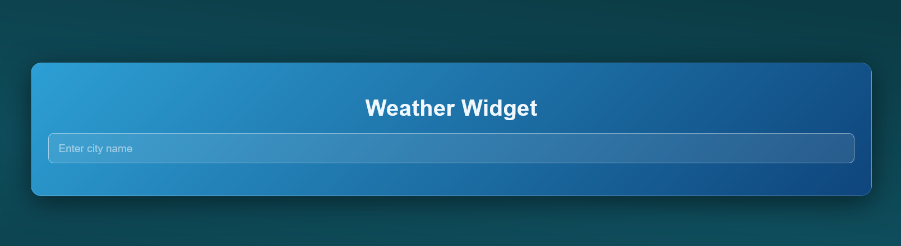

# 🌦️ Weather Widget

Этот проект представляет собой небольшой виджет погоды, написанный на React. Он
позволяет узнать текущую погоду в любом городе или автоматически определяет ваше
местоположение при загрузке страницы.

[](zheny179.github.io/weather-widget/)

## 🚀 Технологии

В проекте использованы следующие технологии:

- **React** (библиотека для создания UI)
- **React Hooks** (`useState`, `useEffect`) — для управления состоянием и
  side effects
- **WeatherAPI** (бесплатный API для получения данных о погоде)
- **Fetch API** и **AbortController** — для выполнения сетевых запросов и их
  отмены

## ⚙️ Как это работает

1. **Геолокация:** При первом открытии приложения браузер запрашивает разрешение
   на определение вашего местоположения. Если вы разрешаете, виджет показывает
   погоду для вашего текущего города.
2. **Поиск:** Вы можете ввести название любого города в поле поиска. Как только
   вы начнете печатать, компонент отправит запрос на сервер и обновит данные.
3. **Обработка ошибок:** Если город не найден, нет интернета или вы запретили
   доступ к геолокации, приложение корректно покажет сообщение об ошибке.
4. **Отмена запросов:** При быстром вводе текста старые запросы автоматически
   отменяются, чтобы не показывать погоду для "частично" введенных слов и не
   перегружать сеть.

## 🛠️ Установка и запуск

### Требования

Перед началом работы убедитесь, что у вас установлены:

- **Node.js** версии 22 или выше ([скачать](https://nodejs.org/))
- **pnpm** версии 8 или выше ([установить](https://pnpm.io/installation))
- **Git** ([скачать](https://git-scm.com/))

### Запуск проекта

Чтобы запустить проект локально, выполните следующие шаги:

1. Склонируйте репозиторий:

   ```bash
   git clone https://github.com/Zheny179/weather-widget.git
   cd weather-widget
   ```
2. Установите зависимости:

    ```bash
    pnpm install
    ```

3. Создайте файл `.env` в корне проекта на основе `.env.example`:

    ```bash
    cp .env.example .env
    
    VITE_WEATHER_API_KEY=ваш_ключ_здесь
    ```

4. Запустите сервер разработки:

    ```bash
    pnpm run dev
    ```

## 📌 Чему я научился в этом проекте

- Работать с хуком useEffect для выполнения действий при монтировании компонента
  и
  при изменении зависимостей.
- Использовать AbortController для отмены fetch-запросов, если компонент
  размонтировался или пользователь ввел новый текст.
- Повторил как работать с API и парсить JSON-ответы.
- Управлять состояниями загрузки (loading), ошибок (error) и основных данных (
  weatherData) с помощью useState.


## 📜Ссылочки

- [Vite](https://astro.build/)
- [React](https://gsap.com/)
- [WeatherAPI](https://www.weatherapi.com/)

---

## 📄 Лицензия

Этот проект распространяется под лицензией MIT. Подробности в
файле [LICENSE](./LICENSE).


